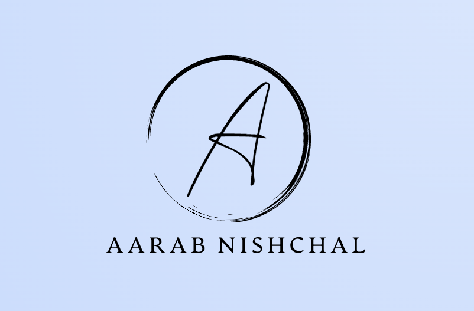

<a name="readme-top"></a>

[![Contributors][contributors-shield]][contributors-url]
[![Forks][forks-shield]][forks-url]
[![Stargazers][stars-shield]][stars-url]
[![Issues][issues-shield]][issues-url]
[![MIT License][license-shield]][license-url]
[![LinkedIn][linkedin-shield]][linkedin-url]


<!-- PROJECT LOGO -->
<br />
<div align="center">
  <a href="https://github.com/losier/v4">
    
  </a>

  <h3 align="center">V4</h3>

  <p align="center">
    An awesome portfolio website to showcase your skills and projects!
    <br />
    <a href="https://github.com/losier/v4/#readme"><strong>Explore the docs »</strong></a>
    <br />
    <br />
    <a href="https://aarab.vercel.app">View Demo</a>
    ·
    <a href="https://github.com/losier/v4/issues">Report Bug</a>
    ·
    <a href="https://github.com/losier/v4/issues">Request Feature</a>
    <br />
    <a href="https://vercel.com/" target="_blank">
        
    </a>
  </p>
</div>


<!-- TABLE OF CONTENTS -->
<details>
  <summary>Table of Contents</summary>
  <ol>
    <li>
      <a href="#about-the-project">About The Project</a>
      <ul>
        <li><a href="#built-with">Built With</a></li>
      </ul>
    </li>
    <li>
      <a href="#getting-started">Getting Started</a>
      <ul>
        <li><a href="#prerequisites">Prerequisites</a></li>
        <li><a href="#installation">Installation</a></li>
      </ul>
    </li>
    <li><a href="#usage">Usage</a></li>
    <li><a href="#roadmap">Roadmap</a></li>
    <li><a href="#contributing">Contributing</a></li>
    <li><a href="#license">License</a></li>
    <li><a href="#contributors">Contributors</a></li>
    <li><a href="#contact">Contact</a></li>
    <li><a href="#acknowledgments">Acknowledgments</a></li>
  </ol>
</details>


<!-- ABOUT THE PROJECT -->
## About The Project
    
Preview of the site |  Responsiveness of the site
:-------------------------:|:-------------------------:
[![Product Name Screen Shot][product-screenshot]](https://example.com)  |  [![Product Name Screen Shot][product-screenshot2]](https://example.com)

This is a personal portfolio website built using React and hosted on Vercel, with the support of Email.js for easy communication with potential employers, clients, and collaborators. The portfolio showcases my skills, experience, and projects in an engaging and interactive way, with a clean design and intuitive navigation that provides a user-friendly experience. The project can also serve as a valuable resource for anyone looking to create their own portfolio website, with its modern web development practices and customizable design.

<p align="right">(<a href="#readme-top">back to top</a>)</p>


### Built With

* [![React][React.js]][React-url]
* [![Bootstrap][Bootstrap.com]][Bootstrap-url]
<!-- * [![Email.js][Email.js]][Email-url]
* [![Vercel][Vercel]][Vercel-url]
* [![GitHub Pages][GitHub Pages]][GitHub Pages-url] -->


<p align="right">(<a href="#readme-top">back to top</a>)</p>


<!-- GETTING STARTED -->
## Getting Started

1. Clone the repository to your local machine using Git.
2. Install the necessary dependencies by running npm install.
3. Customize the content and design of the portfolio to fit your needs.
4. Run the development server using npm start.
5. Open your web browser and navigate to http://localhost:3000/ to view the portfolio.

### Prerequisites

Install the following software on your computer:

  * [Git](https://git-scm.com/downloads)
  * [Node.js](https://nodejs.org/en/download/)
  * [npm](https://www.npmjs.com/get-npm) (comes with Node.js)
  * [Yarn](https://classic.yarnpkg.com/en/docs/install/#windows-stable) (optional but recommended)
    
    - To install these tools on Windows using `winget` and `PowerShell`:
        * ```sh
            winget install -e --id Git.Git
            winget install -e --id Nodejs.Nodejs
            winget install -e --id Yarn.Yarn
    - To install these tools on Windows using `chocolatey` and `PowerShell`:
        * ```sh
            choco install git
            choco install nodejs
            choco install yarn
### Installation

1. Clone the repo
   ```sh
   git clone https://github.com/your_username_/Project-Name.git
   ```
2. Go to the project directory
   ```sh
   cd project-directory
   ```
3. Install NPM packages
   ```sh
   npm install
   ```
4. Start the project
   ```sh
    npm start
    ```
5. Open the project in your browser (Don't worry, it will open automatically)
    ```sh
    http://localhost:3000
    ```
6. Edit the `config.js` file to add your own information and save it.
7. Build the project
    ```sh
    npm run build
    ```
8. Deploy the project to your hosting service (like [Vercel](https://vercel.com/) or [Netlify](https://www.netlify.com/)) and enjoy your new portfolio!

<p align="right">(<a href="#readme-top">back to top</a>)</p>


<!-- USAGE EXAMPLES -->
## Usage

My portfolio (v4) repo can serve as a useful resource for anyone looking to create their own portfolio website. With its clean design and intuitive navigation, this project provides an excellent starting point for showcasing skills and experience. The integration of Email.js also allows for easy communication with potential employers, clients, and collaborators. Whether you're a freelancer, job seeker, or simply looking to build your online presence, this portfolio (v4) repo can provide inspiration and practical solutions for your web development needs.

_For more examples, please refer to the [Documentation](https:github.com/losier/v4/#readme)_

<p align="right">(<a href="#readme-top">back to top</a>)</p>


<!-- ROADMAP -->
## Roadmap

- [x] Add README and LICENSE
- [ ] Add Responsive CSS for project page
- [ ] Fix Contact system
- [ ] Fix ring cursor for small devices

See the [open issues](https://github.com/losier/v4/issues) for a full list of proposed features (and known issues).

<p align="right">(<a href="#readme-top">back to top</a>)</p>


<!-- CONTRIBUTING -->
## Contributing

Contributions are what make the open source community such an amazing place to learn, inspire, and create. Any contributions you make are **greatly appreciated**.

If you have a suggestion that would make this better, please fork the repo and create a pull request. You can also simply open an issue with the tag "enhancement".
Don't forget to give the project a star! Thanks again!

1. Fork the Project
2. Create your Feature Branch (`git checkout -b feature/AmazingFeature`)
3. Commit your Changes (`git commit -m 'Add some AmazingFeature'`)
4. Push to the Branch (`git push origin feature/AmazingFeature`)
5. Open a Pull Request

<p align="right">(<a href="#readme-top">back to top</a>)</p>


<!-- LICENSE -->
## License

[MIT License](https://opensource.org/license/mit/). See `LICENSE` for more information.

<p align="right">(<a href="#readme-top">back to top</a>)</p>

## Contributors

| Avatar                                                         | Name                                              | Contribution                                                                                                                                         |
| -------------------------------------------------------------- | ------------------------------------------------- | ---------------------------------------------------------------------------------------------------------------------------------------------------- |
|           | [Losier](https://github.com/losier)               | Owner of this Repo                                                                                                                                   |
|        | [Sneh Patel](https://github.com/spbavarva)        | [coming soon responsive check](https://github.com/losier/v4/commit/1c73516856115e9261bb6b2e0718ad20df660386)                                         |
|        | [Nihal Arya](https://github.com/Aryanihal)        | [Create CODE_OF_CONDUCT.md](https://github.com/losier/v4/commit/41295c4eaf7b6568c30f2bce093b1768d98e7a36)                                            |
|      | [Gal Malach](https://github.com/GalMalach08)      | [fix the navbar when scroll](https://github.com/losier/v4/commit/fe699536343e9f213873faec915fa9eacadeb037)                                           |
|     | [makssmeinart](https://github.com/makssmeinart)   | [1. Fixed few paddings in Navbar on mobile resolutions. 2. Added small…](https://github.com/losier/v4/tree/ac6f0f5196489d4fccd9e2c51bf84a7a3ebfa7ed) |
|  | [Carlos Alba](https://github.com/CarlosAlbaLopez) | [Redirect to a section in react](https://github.com/losier/v4/commit/518a98a8c6d95db26bc235971b4c5ff805d22db1)                                       |
|     | [Ullas Kunder](https://github.com/ullaskunder3)   | [🐼fixed mobile view and some bugs](https://github.com/losier/v4/commit/594401f9ee4e3930f298612c095a7df36bb2346a)                                    |
|         | [Thendo](https://github.com/Thendo-T)             | [fix loader ring issue](https://github.com/losier/v4/commit/73b980b6e1b109f38edf92619383844cc3cd70fe)                                                |


<p align="right">(<a href="#readme-top">back to top</a>)</p>

<!-- CONTACT -->
## Contact

Aarab - [@aarabuibuibui](https://instagram.com/aarabuibuibui) - nishu@duck.com

Project Link: [https://github.com/losier/v4](https://github.com/losier/v4)

<p align="right">(<a href="#readme-top">back to top</a>)</p>


<!-- ACKNOWLEDGMENTS -->
## Acknowledgments

* [Brittany Chiang](https://brittanychiang.com/).
* [EGATOR](https://www.youtube.com/c/EGATORTUTORIALS).
* [Some Devs From StackOverFlow](https://stackoverflow.com/)
* [Some Devs From CodePen](https://codepen.io/)
* [Rahul](https://dev.to/holdmypotion/react-custom-cursor-no-extra-dependencies-25ki)

<p align="right">(<a href="#readme-top">back to top</a>)</p>


<!-- MARKDOWN LINKS & IMAGES -->
[contributors-shield]: https://img.shields.io/github/contributors/losier/v4.svg?style=for-the-badge
[contributors-url]: https://github.com/losier/v4/graphs/contributors
[forks-shield]: https://img.shields.io/github/forks/losier/v4.svg?style=for-the-badge
[forks-url]: https://github.com/losier/v4/network/members
[stars-shield]: https://img.shields.io/github/stars/losier/v4.svg?style=for-the-badge
[stars-url]: https://github.com/losier/v4/stargazers
[issues-shield]: https://img.shields.io/github/issues/losier/v4.svg?style=for-the-badge
[issues-url]: https://github.com/losier/v4/issues
[license-shield]: https://img.shields.io/github/license/losier/v4.svg?style=for-the-badge
[license-url]: https://github.com/losier/v4/blob/master/LICENSE.txt
[linkedin-shield]: https://img.shields.io/badge/-LinkedIn-black.svg?style=for-the-badge&logo=linkedin&colorB=555
[linkedin-url]: https://linkedin.com/in/aarab-nishchal
[product-screenshot]: https://raw.githubusercontent.com/losier/v4/data/images/demo.png
[product-screenshot2]: https://raw.githubusercontent.com/losier/v4/data/images/demo2.png
[logo]: https://raw.githubusercontent.com/losier/v4/data/images/logo.png
[React.js]: https://img.shields.io/badge/React-20232A?style=for-the-badge&logo=react&logoColor=61DAFB
[React-url]: https://react.dev/
[Bootstrap.com]: https://img.shields.io/badge/Bootstrap-563D7C?style=for-the-badge&logo=bootstrap&logoColor=white
[Bootstrap-url]: https://getbootstrap.com
[JavaScript]: https://img.shields.io/badge/JavaScript-323330?style=for-the-badge&logo=javascript&logoColor=F7DF1E
[JavaScript-url]: https://www.javascript.com/
[HTML5]: https://img.shields.io/badge/HTML5-323330?style=for-the-badge&logo=html5&logoColor=E34F26
[HTML5-url]: https://html.com/
[CSS3]: https://img.shields.io/badge/CSS3-323330?style=for-the-badge&logo=css3&logoColor=1572B6
[CSS3-url]: https://www.w3.org/Style/CSS/Overview.en.html
